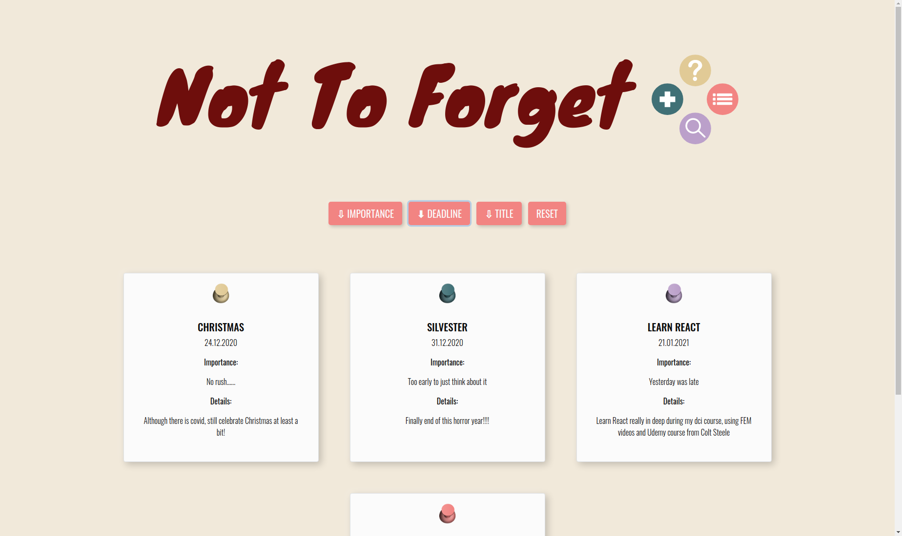
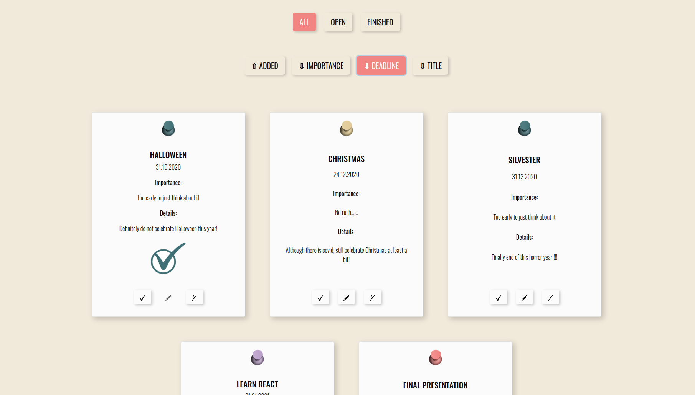
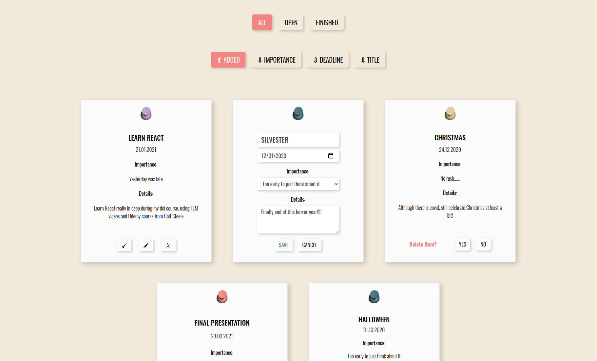

<h1> </h1>

"Never more forget your important dates!"

Explore [Live demo](https://alice-rez.github.io/Not-to-forget/) or look at previews in [Gallery](#gallery)

## Description

Simple React to-do app. Work in progress - adding new features and making code better as I learn more about React.

For basic showing of the function, five static tasks (four open, one finished) were added as a default (but if you want to test app, you can add any other items you want :) ).

Currently serverless, just front-end with React where all changes disappear when refresh the page.

**Current functionalities (omega version):**

- adding new to-do item (title, deadline and level of importance are mandatory, details are obligatory, forms reset after adding item)



- list all of the to-do item

- importance of the task is also depicted by color of used pin (purple for the most important, green for the least)

- sorting listed items according to their importance, deadline or alphabetically by title with possible reset to default order (the order they were added in)

- searching for the to-do with specific name

- basic autocomplete function showing all names of existing items that corresponds to the typed search keyword (working just using mouse now)

- possibility to check/uncheck task (to mark it as finished one), edit task (you can save changes or cancel the editing and go back to original state) or delete it (with display of alert if you want to delete it)

- check/delete/edit is available in list of item but also when searched item is displayed in search 8just when change title in search mode, task will be no longer displayed for that search)

- in list of all to-do, user can display all tasks or just open/finished once

## Setup

1. Clone repository
2. ```
   cd <your-repository-name>
   npm install
   ```
3. ```
   npm start
   ```
4. Enjoy

## Implementation

**Used technologies**: React, Create React App, React Router, functional components, class components, React Hooks, react Context, getDerivedStateFromProps life cycle method, customized sorting function in sort, JSX, CSS, CSS variables, Bootstrap, SVG

For the project configuration was used Create React App package.

Bootstrap was used for basic styling but heavily customized.

## Acknowledgement

This project was bootstrapped with [Create React App](https://github.com/facebook/create-react-app).

## Gallery

**Fig.1** : Not default sorting chosen, one of tasks is checked (finished)



</br>
</br>
</br>

**Fig.2** : Editing and deleting dialogues



</br>
</br>
</br>
