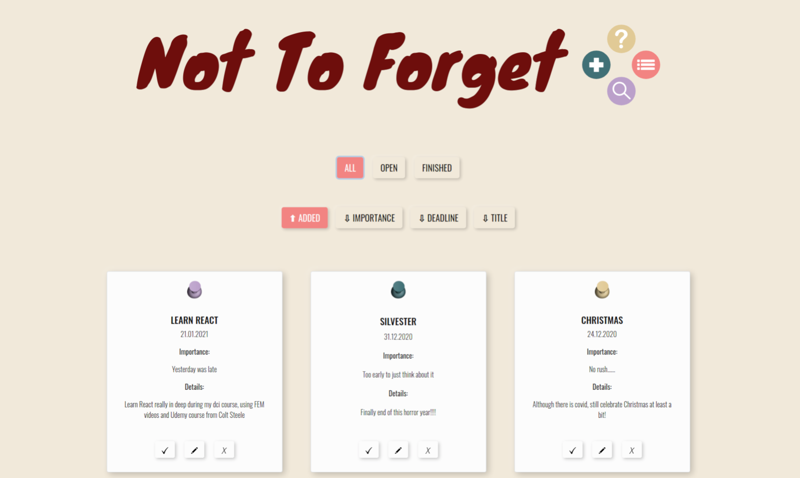

<h1> </h1>

[Live demo](https://alice-rez.github.io/Not-to-forget/)

Simple React to-do app. Work in progress - adding new features and making code better as I learn more about React.

For basic showing of the function, four static tasks were added as a default (but if you w ant to test app, you can add any other items you want :) ).

Currently serverless, just front-end with React.



**Current functionalities (omega version):**

- adding new

## Setup

1. Clone repository
2. ```
   cd <your-repository-name>
   npm install
   ```
3. ```
   npm start
   ```
4. Enjoy
